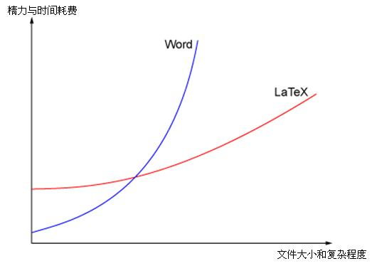
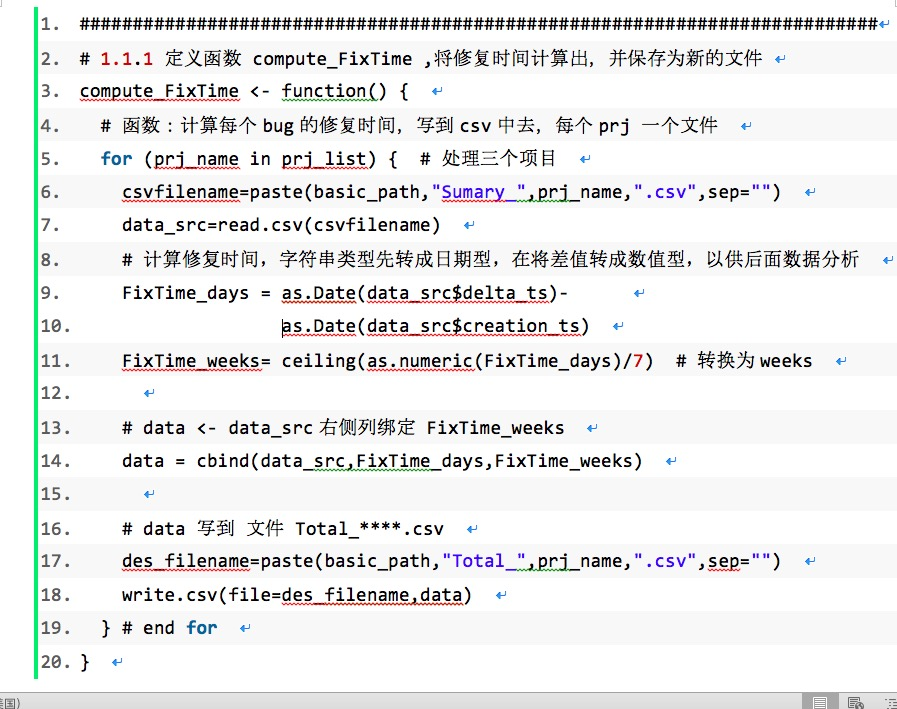

# Overall requirements for writing graduation thesis

## 1. Thesis formatting and commonly used software

0. Thesis formatting [B station tutorial](https://www.bilibili.com/video/BV1GT4y137wQ?p=9)

1. Thesis writing: Use MS-Word (Office 2010 or above), do not accept documents output by other software (Word compatibility documents have problems!) Nantong University [Microsoft Software Genuine Download and Installation Guide](./MS_Guide.md)

2. Drawing:
+ Use Visio to draw, font size 10pt, Times New Roman
+ Or draw online [ProcessOn website](http://www.processon.com) ``Free``
+ UML diagram, it is strongly recommended to use PlantUML to draw, refer to the following website:
- Based on PlantUML UML platform [Syntax Tutorial](https://plantuml.com/zh/starting),
- You can edit UML diagrams locally, download PlantUML's [JAR package](https://sourceforge.net/projects/plantuml/files/plantuml.jar/download)
- You can also [edit UML diagrams online](http://www.plantuml.com/plantuml/uml/)

3. Tables: Use word to insert tables, font size 10pt, Times New Roman
4. Code: Use `PlanetB website` [click the website link](http://www.planetb.ca/syntax-highlight-word) to help convert, and then copy it to the Word document.

## 2. Content requirements
1. The total number of pages should not be less than 46 pages. PS: Those with less than 46 pages are not allowed to participate in the defense.
2. The text should be fluent and there should be no more than 3 typos. PS: During the acceptance, if there are more than 3+3 incorrect sentences or typos, they will be directly returned for reprinting.
3. In addition, try to avoid using the first person (I, we, etc.) in the paper. Only the acknowledgment part can use the first person.
4. English abbreviations: Students, please pay attention to [[Common English abbreviation fixed expression link](http://www.cnblogs.com/juking/p/6878570.html)] when writing papers (do not write them casually)
5. Common error examples:
+ `Java` cannot be written as `JAVA`,
+ `JUnit` cannot be written as `JUNIT`,
+ `WPS` cannot be written as `wps`
+ `Windows` cannot be written as `windows`
+ `MySQL` cannot be written as `mysql`, etc.
+ `Web` cannot be written as `web`
+ `SQLLite` cannot be written as `sqllite`
+ `PHP` cannot be written as `php`
+ `API` cannot be written as `api`

## III. Requirements for Figures, Tables, and Codes

### 1. Drawing of Figures

1. The figure title is centered directly below the figure, as shown in the example:

Figure 3.4 ****Figure 

+ Explanation: 3 represents Chapter 3, and 4 represents the fourth figure in the chapter.

2. The text in the figure is Times New Roman 5.

3. Use Visio as much as possible to draw, and do not use Word to draw directly.

+ If you use Visio to draw, you can press ctrl +A, ctrl +c in Visio, and then press ctrl +v in Word

4. Lines: horizontal and vertical; try not to intersect.
5. Box: Use as few words as possible, and try to keep a line of text semantically complete. Align it horizontally and vertically with other boxes as much as possible, and keep the same size;
6. The following are examples of figures:

Figure 3.4 Comparison of Latex and Word cost (title is placed directly below the illustration)

7. When introducing a figure, the correct method is:
+ **** `As shown in Figure 3-2`, ****
+ Don't say: `"The entire system flow chart is as shown below"`
+ You write `"As shown below"`, what if the figure moves to the next page?

### 2. Drawing of tables
1. The table title is centered above the figure, as shown in the example:
+ Table 3-4 *******
+ Explanation: PS: 3 means Chapter 3, 4 means the 4th table in the chapter. The text in the figure is Times New Roman 5.
+ Try to use three-line tables (place the title above the table)
2. The font size of the table should be one size smaller than the text (size 5) and single-spaced
3. The following is an example:

Table 3-4 Student Information

|Name|Age|Gender|
|:--|--:|--:|
| Zhang San| 18| Female |
| Xiao Ming| 23| Male |

### 3. Drawing code
1. Frame it with a text box, font size (size 5), single-spaced line spacing. Only paste the core and key code.
1. Good readability!
2. Pay attention to the indentation of the code

2. How to paste code in Word?
1. Generate code paste [Website: PlanetB](http://www.planetb.ca/syntax-highlight-word)
2. How to generate code snippets that can be pasted into Word? [Tutorial](https://blog.csdn.net/u011303443/article/details/50992651)

3. The code example is as follows

 *** Code

## 4. Format requirements
1. Headers and footers, the body must add headers and footers
2. All English Times new Roams. PS: Ctrl + A select all, set the font
3. All chapters are separated by section breaks. Use the menu [Insert]--[Section Break] to achieve
4. Graphics should not be too many or too large, screenshots and images are prohibited, and only the parts related to the content are selected for graphics.
5. Set line spacing, paragraph spacing, etc. according to the template