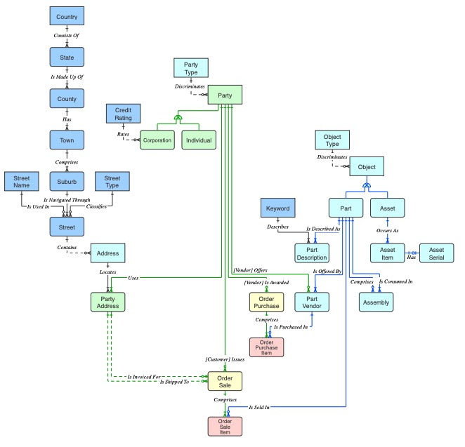

This part introduces the system architecture design (system flow chart, data flow chart, etc., database design (if a database is needed))

## 1. Chapter content
### Chapter 4 *** System analysis and structural design ..................................17
#### 4.1 System flow chart......................................................17
#### 4.2 Database logical structure design...................................................18
#### 4.3 System architecture...................................................................20
#### 4.4 Summary of this chapter...................................................................21

## 2. Overall requirements
+ Word count: > 5000 words
+ Page number: > 5 pages

## 3. Chapter 1: System flow chart
Answer: PS not less than 500 words (3 paragraphs)
+ Paragraph 1: Briefly introduce the main functions of the system and the entity analysis in the system;
+ Paragraph 2: Paste the map. System flowchart (Framework, must be drawn in Visio, font Songti, font size 5, i.e. 10pt)
+ The third paragraph: Detailed description of the system flowchart module. After showing the system flowchart (system structure diagram), a paragraph should be added to explain each module in the diagram.

## IV. Chapter 2: Database logical structure design
Answer: PS no less than 800 words
+ Data flowing in the system, data structure, which are temporary data, which are persistent data
+ Describe ERD (strongly recommended to draw in Visio, font Songti, font size 5, i.e. 10pt)
- [ERD example link](http://www.softwaregems.com.au/Documents/Documentary%20Examples/Order%20DM%20Advanced.pdf)
- ERD example of the entity corresponding to the database table:
- 
- Note: The attributes of the entity in the ERD diagram can be omitted.

## 5. Chapter 3: System Architecture
Answer: PS no less than 800 words (written in 3 parts)
+ Functional decomposition, describe the relationship between each functional module (important!!!)
+ System framework diagram of the system (in the form of UML package diagram, Visio drawing, font Songti, font size 5, i.e. 10pt)
+ Brief description of the system framework diagram (package diagram).

## 6. Chapter 4: Summary of this chapter
Answer: PS no less than 300 words
+ Overview of the content of this chapter.
+ For example: This chapter introduces . . . . , analyzes . . . . . , and gives . . . . . . on the basis of elaborating . . . .